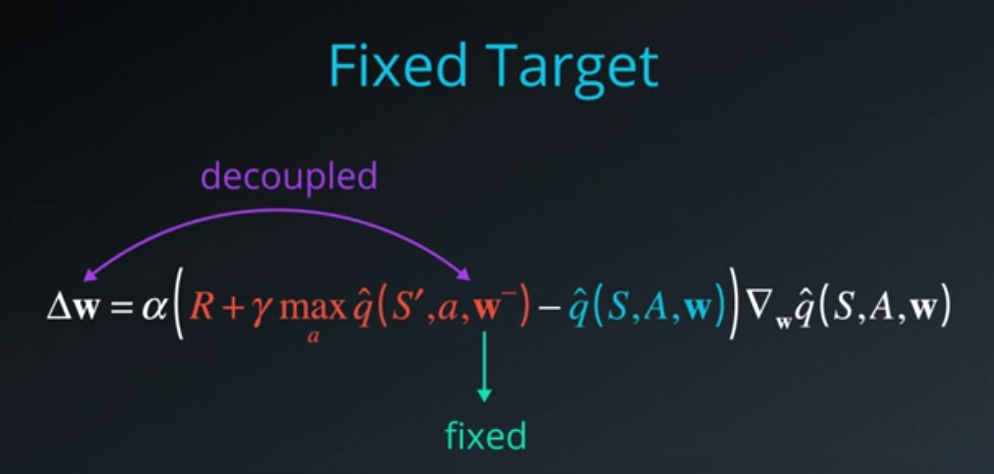
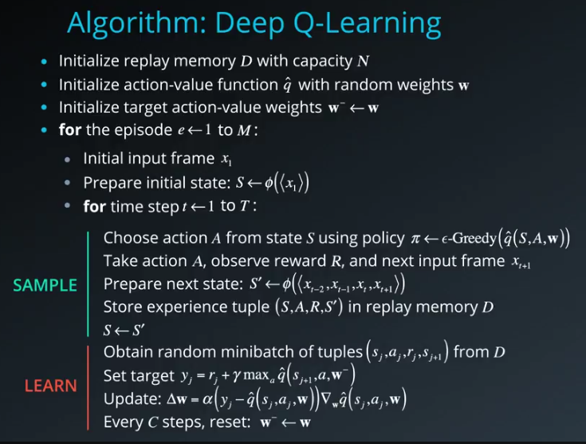
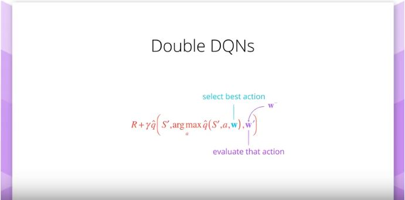
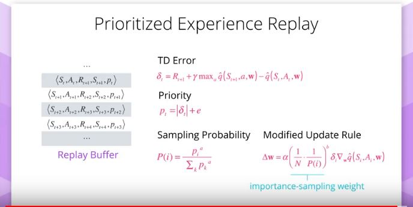
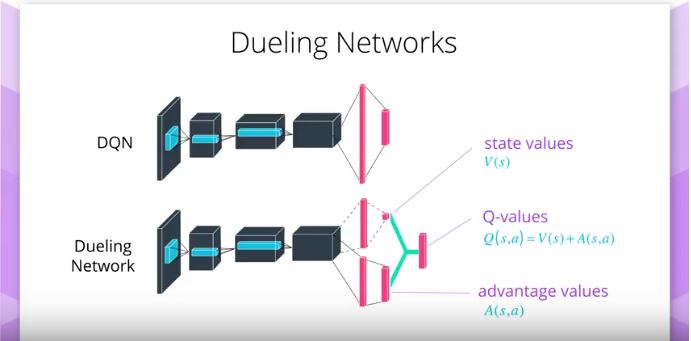
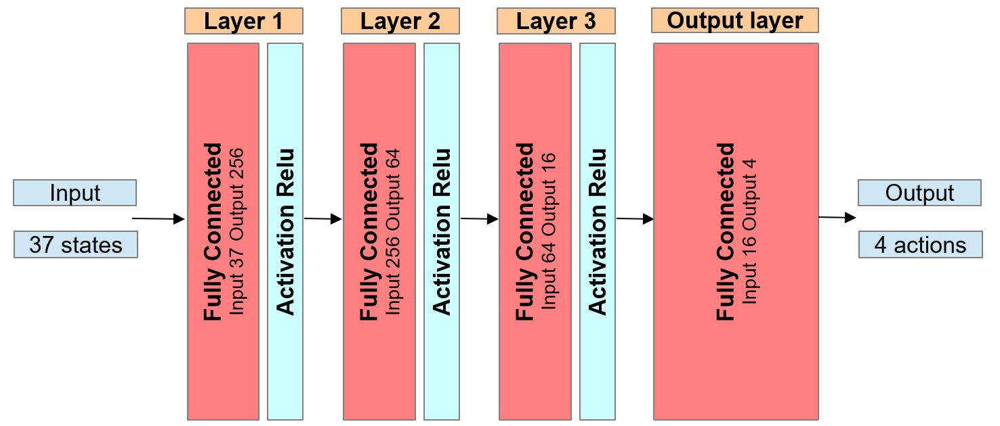
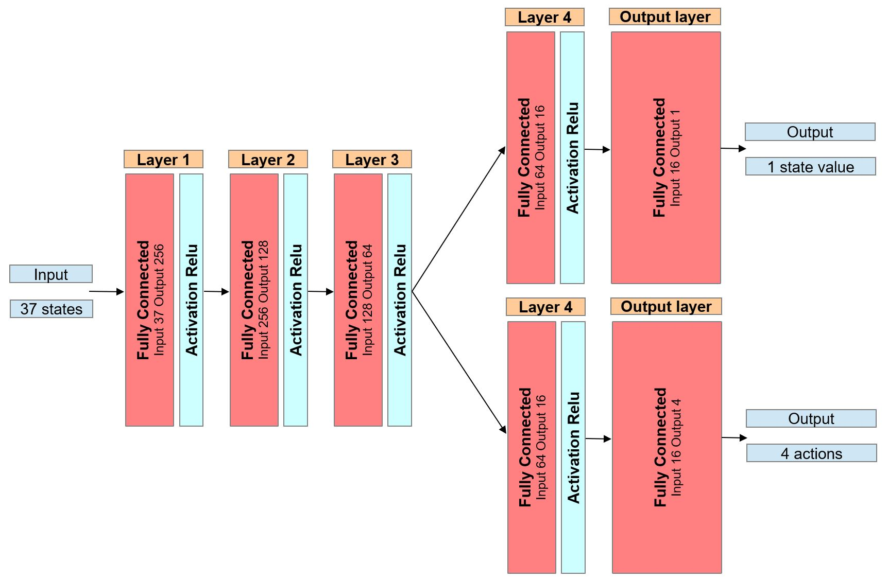

# Project 1: Navigation

## Goal of this project

In this project an agent is set up and trained to navigate and collect yellow bananas in a large square world. The goal of this project is to design, train and evaluate an agent that collects as many yellow bananas as possible in a large square world while avoiding to pick up blue bananas. Therefore a deep reinforcement algorithm has to be implemented. Here an angent with an Deep Q-Learning (DQN) algorithm and several additional improvements like Double DQN (DDQN), Dueling Neural Architecture and DQN with prioritized experience replay is implemented.

## Description of the implementation

### Learning algorithm

Reinforcement Learning is described in terms of an agent interacting with a previsouly unknown environment while trying to maximize the overall or total reward. The agent outputs an action and the environment returns an observation or the state of the system and a reward. In order to fullfil its goal to maximize the total reward the agent has to choose the best action to take. 

With Deeo Reinforcement Learning this agent is using nonlinear function approximators to calculate the value actions based directly on observation from the environment. We represented it as a Deep Neural Network. We then use Deep Learning to find the optimal parameters for these function approximators. 

Unfortunately, reinforcement learning is notoriously unstable when neural networks are used to represent the action values. Therefore we should use **two key** features to overcome with this and enable RL agents to converge, more reliably during training:

- **Experience Replay**
    => use of a rolling history of the past data via replay pool. The act of sampling a small batch of tuples form the replay buffer in oder to learn is known as **experience replay**. Advantages:
    - the behavior distribution is averaged over many of its previous states
    - smoothing out learning and
    - avoiding oscillations
    - each step of the experience is potentially used in many weight updates
    - more efficient use of observed experiences
    - breaks up the potentially highly correlated sequence of experienced tupels

- **Fixed Q-Targets**
    => use of a target network to represent the old Q-function, which will be used to compute the loss of every action during training
    -  otherwise as the Q-functions values change at each step of training the value estimates can easily spiral out of control
    -  To use the fixed Q-Targets technique, you need a second set of parameters w- which you can initialize to w. 

**Pyeudo Code for Deep Q-Learning Algorithm**

This project implements a Value Based method called [Deep Q-Networks](https://storage.googleapis.com/deepmind-media/dqn/DQNNaturePaper.pdf)

### Enhancements

Several improvements to the natural Deep Q-Learning algorithme have been suggested. Three of them are implemented in the algorithm used here:

- **Double DQN**
    + addresses the problem of overestimation of action values that Q-learning is prone to. Reason for that:
    + in the beginning Q-values are still evolving
    + the accuracy of our Q-values depends a lot on what actions have been tried
    + algorithm always picks the maximum among a set of noisy numbers
    + solution:
        * we select the best action using one set of parameters w
        * but evaluate it using a different set of parameters w'
    That's like having two separate function approximators that must agree on the best action.

- **Prioritized Experience Replay**
    + some of the experiences stored in the replay buffer may be more important for learning than others
    + these important experiences might even occur infrequently
    + sampling the batches uniformly, these experiences have a very small chance of getting selected
    + since buffers are limited in capacity, older important experiences may get lost
    + solution:
        * assign priorities to each tupel (e.g. use TD error delta. The bigger the error, the more we expect to learn from that tupel.)
    

- **Dueling DQN**
    + intuition behind this is that the value of most states donn't vary a lot across actions. So the core idea is to use two different streams:
        * one that estimates the state value function
        * one that estimates the advantage for each action. 

### Code Implementation

Code implementation is discribed in the jupyter notebook and is structured as follows:

- **Import of all necessary packages**
- **Neural Network - class QNetwork**
    + will be trained to predict the action to perform depending on the observed states
    + regular fully connected Deep Neural Network using the PyTorch Framework
        
- **Dueling Network - class duelingQNetwork**
    + will be trained to predict the action to perform depending on the observed states
    + regular fully connected Deep Neural Network with two branches using the PyTorch Framework
        
- **DQN Agent - class Agent**
    + a dqn agent with dueling network, prioritized experience replay and double DQN is defined:
        * constructor:
            - initializes the memory buffer
            - initializes the neural network
            - initializes the optimizer
        * step()
            - adds tupels (state, action, reward, next_state, done) to memory
            - starts learning step at each UPDATE_EVERY step
        * act()
            - returns actions for given state as per current policy (epsilon greedy)
        * learn()
            - updates value parameters using given batch of prioritized experience tuples
        * soft_update()
            - softly updates the weights from the local model to the target model as part of the Fixed Q-Targets technique
- **DQN Agent - class Prio_ReplayBuffer**
    + fixed-size buffer to store experience tuples (state, action, reward, next_state, done)
        * add() 
            - adds an experienced tupel to the memory
            - connects a starting priority to the tupel - updated in the next learning step
        * sample() 
            - samples a batch of experienced tupels accordings to the probability distribution
        * update_TD_deltas()
            - updates the priorities according to the learning step
        * new_beta()
            - calculates a new beta value for calculating importance weights
- **dqn - modul**
    + trains an agent using DQN and returns the scores

### Training and Hyperparameter

The DQN agent uses the following parameters values:

- BUFFER_SIZE = int(1e6)  = replay buffer size
- BATCH_SIZE = 128        = minibatch size
- GAMMA = 0.99            = discount factor
- TAU = 1e-3              = for soft update of target parameters
- LR = 1e-4               = learning rate 
- UPDATE_EVERY = 3        = how often to update the network

- DoubleDQN = True        = Use Double DQN
- DuelingDQN = True       = Use Dueling DQN
- Exp_replay_DQN = True   = Use priotized experience replay

PRIORITIZED EXPERIENCE REPLAY PARAMETERS:
- MIN_P = 0.001           = value added to the TD errors when updating priorities
- ALPHA_ = 0.57           = how much prioritization is used (0 - no prioritization, 1 - full prioritization)
- BETA_START = 0.0001     = importance sampling weight - degree for use (0 - no correction, 1 - full correction), starting value
- BETA_DELTA = 0.0004     = importance sampling weight  -  change of beta at each step

EXPLORATION/EXPLOTATION PARAMETERS (EPSILON_GREEDY):
- eps_start = 0.5         = starting value
- eps_end = 0.01          = minimum value
- eps_decay = 0.87        = multiplicative factor for decreasing

- n_episodes = 2000       = number of episods
- max_t=10000             = length of episod

OPTIMIZER               = ADAM

### Results

These results meets the project's expectation as the agent is able to receive an average reward (over 100 episodes) of at least +13, and in 1023 episodes only.

### Future Ideas for improving the agent's performance

There are some other possible extensions to the DQN algorithm which are worth to give them a shot. For example:

- Learning from multi-step bootstrap targets
- Distributional DQN
- Noisy DQN

Researchers at Google DeepMind recently tested the performance of an agent that incorporated all six of these modifications. The corresponding algorithm was termed Rainbow.

A further step to this project would be to train the agent directly form the environment's observed raw pixels (84x84) instead of using the environment's internal states (37 states). To make use of these images the neural network has to be changed from a fully connected layer structure to a convolutional neural network, which can process the raw pixels.

## Literature

[Double DQN (DDQN)](./rersources/203_20151208_vHasselt_et_al_DRL_with_Double_Q-learning_1509.06461.pdf)

[Prioritized experience replay](./rersources/203_20160225_Schaul_et_al_Prioritized_Experience_Replay_1511.05952.pdf)

[Dueling DQN](./rersources/203_20160405_Wang_et_al_Dueling_Network_Architectures_4DRL_1511.06581.pdf)

[Multi-step bootstrap targets](./rersources/203_20160616_Mnih_el_at_Asynchronous_Methods_f_DRL_1602.01783.pdf)

[Distributional DQN](./rersources/203_20170721_Bellemare_et_al_A_Distributional_Perspective_on_RL_1707.06887.pdf)

[Noisy DQN](./rersources/203_20180215_Fortunato_et_al_Noisy_Networks_f_Exploration_1706.10295.pdf)

[Rainbow Algorithm](./rersources/203_20171006_Hessel_et_al_Rainbow_Combining_Imporvments_in_DRL_1710.02298.pdf)

## Contributing

No further updates nor contributions are requested.  This project is static.

## License

Part2_Project_Navigation results are released under the [MIT License](./LICENSE)