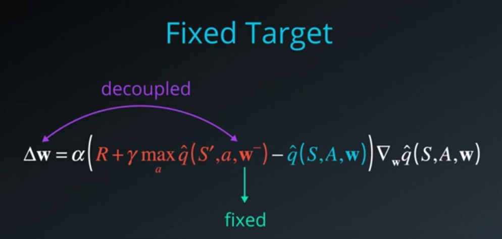
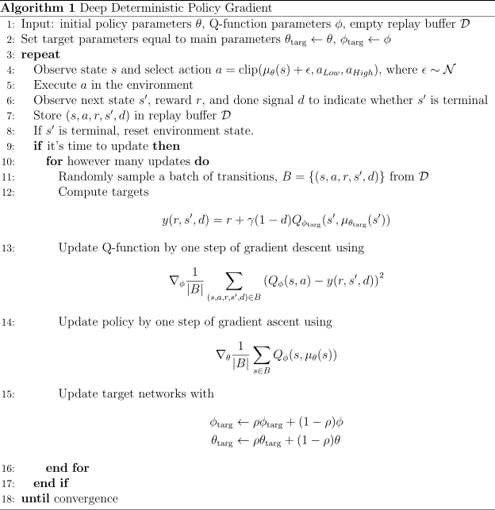

# Project 3: Continuous Control

## Goal of this project

The goal of this project is to design, train and evaluate an agent that moves a double-jointed arm to target locations. A reward of +0.1 is provided for each step that the agent's hand is in the goal location. Thus, the goal of your agent is to maintain its position at the target location for as many time steps as possible.

Therefore a deep reinforcement algorithm has to be implemented. Here an angent with an Deep Deterministic Policy Gradient (DDPG) algorithm and several additional improvements for getting a more stabilized learning is implemented:

-   Replay buffer
-   Target Q network with soft target updates
-   Batch normalization
-   Noise added, so we can treat the problem of exploration independent form the learning algorithm (Ornstein-Uhlenbeck process)

## Description of the implementation

### Learning algorithm

This project implements an off-policy method called Deep Deterministic Policy Gradient and described in the paper [Continuous control with deep reinforcement learning](./resources/305_20160229_Lillicrap_et_al_Continuous_control_with_DRL.pdf). Deep Deterministic Policy Gradient (DDPG) is an algorithm which concurrently learns a Q-function and a policy. It uses off-policy data and the Bellman equation to learn the Q-function, and uses the Q-function to learn the policy.

Unfortunately, reinforcement learning is notoriously unstable when neural networks are used to represent the action values. Therefore we should use **two key** features to overcome with this and enable RL agents to converge, more reliably during training:

- **Experience Replay**
    => use of a rolling history of the past data via replay pool. The act of sampling a small batch of tuples form the replay buffer in oder to learn is known as **experience replay**. Advantages:
    - the behavior distribution is averaged over many of its previous states
    - smoothing out learning and
    - avoiding oscillations
    - each step of the experience is potentially used in many weight updates
    - more efficient use of observed experiences
    - breaks up the potentially highly correlated sequence of experienced tupels

- **Fixed Q-Targets**
    => use of a target network to represent the old Q-function, which will be used to compute the loss of every action during training
    -  otherwise as the Q-functions values change at each step of training the value estimates can easily spiral out of control
    -  To use the fixed Q-Targets technique, you need a second set of parameters w- which you can initialize to w. 

**Pyeudo Code for Deep Deterministic Policy Gradient (DDPG) algorithm**

This project implements a Policy Based method called [DDPG](./resources/305_20160229_Lillicrap_et_al_Continuous_control_with_DRL.pdf).

### Training and Hyperparameter

The DDPG agent uses the following 
PARAMETER VALUES:
- BUFFER_SIZE = int(1e5)    # replay buffer size
- BATCH_SIZE = 128          # minibatch size
- RANDOM_SEED = 1           # ramdom seed
- GAMMA = 0.99              # discount factor
- TAU = 1e-3                # for soft update of target parameters
- LR_ACTOR = 1e-4           # learning rate of the actor
- LR_CRITIC = 1e-3          # learning rate of the critic
- WEIGHT_DECAY = 0          # L2 weight decay
- NUM_AGENTS = 20           # Number of agents
- LEARN_EVERY = 10          # Learn every x time steps
- LEARN_UPDATES = 8         # Number of learning steps 

MODEL: 
- A_FC1_UNITS = 256         # Actor: Number of nodes in first hidden layer
- A_FC2_UNITS = 128         # Actor: Number of nodes in second hidden layer
- C_FCS1_UNITS = 256        # Critic: Number of nodes in first hidden layer
- C_FC2_UNITS = 128         # Critic: Number of nodes in second hidden layer
- OPTIMIZER = ADAM 

NOISE PARAMETERS:
- OUNOISE_Theta = 0.15      # Theata for Ornstein-Uhlenbeck process
- OUNOISE_SIGMA = 0.2       # Sigma for Ornstein-Uhlenbeck process
- OUNOISE_MU = 0.           # Mue for Ornstein-Uhlenbeck process

PRIORITIZED EXPERIENCE REPLAY PARAMETERS:
- PRIO_REPLAY_DDPG = True   # Use priotized experience replay
- MIN_P = 0.001             # value added to the TD errors when updating priorities
- ALPHA_ = 0.57             # how much prioritization is used (0 - no prioritization, 1 - full prioritization)
- BETA_START = 0.0001       # importance sampling weight - degree for use (0 - no correction, 1 - full correction), starting value
- BETA_DELTA = 0.0004       # importance sampling weight  -  change of beta at each step  

TRAINING:
- N_EPISODES = 300          # Number of episodes
- MAX_T = 1000              # Max length of one episode
- BATCH_NORMAL = True       # Enable batch normalization

### Results

The agent is able to receive an average reward (over 100 episodes) of at least +30 in only 22 episodes as shown in the following chart.  

#### Untrained agent performing random actions

#### Trained agent performing appropriate actions

### Future Ideas for improving the agent's performance

There are some further methods that will be more stable with the project. Better performance is promised by the use of Trust Region Policy Optimization (TRPO) or Truncated Natural Policy Gradient (TNPG) as proposed in this [publication](https://arxiv.org/abs/1604.06778). 
Other algorithms like the Proximal Policy Optimization ([PPO](https://arxiv.org/pdf/1707.06347.pdf)), [A3C](https://arxiv.org/pdf/1602.01783.pdf) or [D4PG](https://openreview.net/forum?id=SyZipzbCb) have also demonstrated good performance with continuous control tasks.
A minor task could be an in deep tuning of the hyperparameters with a grid search method or the use of an other noise process for exploration.

## Literature

[DDPG](https://arxiv.org/abs/1509.02971)

[TRPO](https://arxiv.org/abs/1604.06778)

[PPO](https://arxiv.org/pdf/1707.06347.pdf)
[PPO@openai.com](https://blog.openai.com/openai-baselines-ppo/)

[D4PG](https://openreview.net/forum?id=SyZipzbCb)

[A3C](https://arxiv.org/pdf/1602.01783.pdf)

## Contributing

No further updates nor contributions are requested.  This project is static.

## License

Part3_Project_Continuous_Control results are released under the [MIT License](./LICENSE)