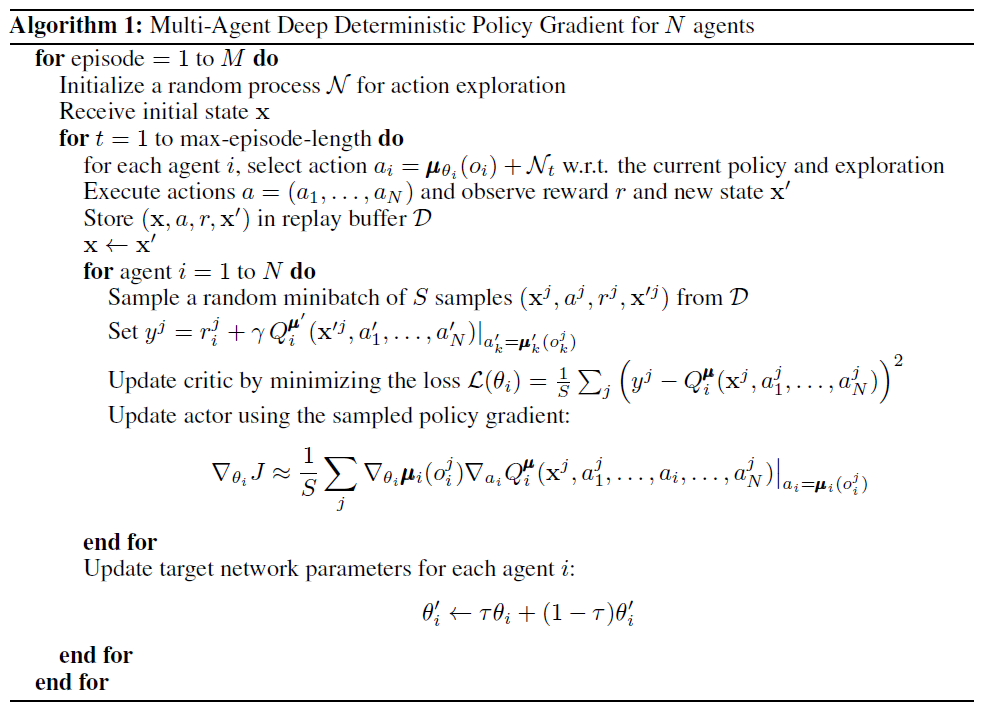
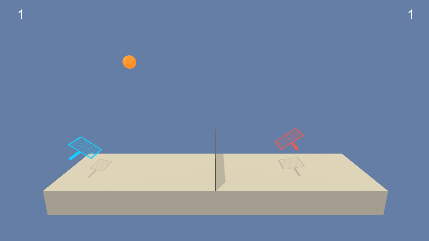
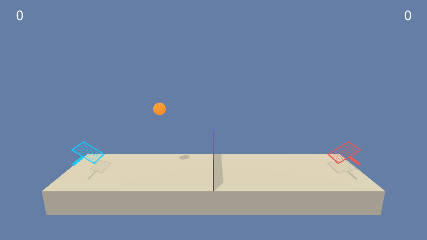

# Project 4: Collaboration and Competition

## Goal of this project

The goal of this project is to design, train and evaluate two agents so that they can bounce a ball over a net as often as possible. If an agent hits the ball over the net, it receives a reward of +0.1. If an agent lets a ball hit the ground or hits the ball out of bounds, it receives a reward of -0.01. Thus, the goal of each agent is to keep the ball in play.

Therefore a deep reinforcement algorithm has to be implemented. Here an multi agent concept with an Deep Deterministic Policy Gradient (DDPG) algorithm and several additional improvements for getting a more stabilized learning is implemented:

-   Replay buffer
-   Target Q network with soft target updates
-   Batch normalization
-   Noise added, so we can treat the problem of exploration independent form the learning algorithm (Ornstein-Uhlenbeck process)

## Description of the implementation

### Learning algorithm

This project implements an off-policy method called Multi-Agent Deep Deterministic Policy Gradient as described in the paper [Multi-agent actor-critic for mixed cooperative-competitive environments](https://papers.nips.cc/paper/7217-multi-agent-actor-critic-for-mixed-cooperative-competitive-environments.pdf). Deep Deterministic Policy Gradient (DDPG) is an algorithm which concurrently learns a Q-function and a policy. It uses off-policy data and the Bellman equation to learn the Q-function, and uses the Q-function to learn the policy.

Unfortunately, reinforcement learning is notoriously unstable when neural networks are used to represent the action values. Therefore we should use **two key** features to overcome with this and enable RL agents to converge, more reliably during training:

- **Experience Replay**
    => use of a rolling history of the past data via replay pool. The act of sampling a small batch of tuples form the replay buffer in oder to learn is known as **experience replay**. Advantages:
    - the behavior distribution is averaged over many of its previous states
    - smoothing out learning and
    - avoiding oscillations
    - each step of the experience is potentially used in many weight updates
    - more efficient use of observed experiences
    - breaks up the potentially highly correlated sequence of experienced tupels

- **Fixed Q-Targets**
    => use of a target network to represent the old Q-function, which will be used to compute the loss of every action during training
    -  otherwise as the Q-functions values change at each step of training the value estimates can easily spiral out of control
    -  To use the fixed Q-Targets technique, you need a second set of parameters w- which you can initialize to w. 

#### Multi-Agent DDPG

But as shown in the paper **[Multi-agent actor-critic for mixed cooperative-competitive environments](https://papers.nips.cc/paper/7217-multi-agent-actor-critic-for-mixed-cooperative-competitive-environments.pdf)**
>unfortunately, traditional reinforcement learning approaches such as Q-Learning or policy gradient are poorly suited to multi-agent environments.

One problem is, that 
>each agent’s policy is changing as training progresses, and the environment becomes non-stationary from the perspective of any individual agent.

The authors propose a general-purpose multi-agent learning algorithm with the following goals:
1. the policies which are learned use only local informations (their own observations)
2. there is no need of a differentiable model of the environment dynamics as it would be the case for a model-based policy optimization which learns via back-propagation
3. not only useable for cooperative interaction but also for competitive or a mixture of both

The authors accomplish this 
>by adopting the framework of centralized training with decentralized execution. Thus, we allow the policies to use extra information to ease training, so long as this information is not used at test time. It is unnatural to do this with Q-learning, as the Q function generally cannot contain different information at training and test time. Thus, we propose a simple extension of actor-critic policy gradient methods where the critic is augmented with extra information about the policies of other agents, while the actor only has access to local information. After training is completed, only the local actors are used at execution phase, acting in a decentralized manner and equally applicable in cooperative and competitive settings.

The main idea behind the Multi-Agent DDPG conecpt is shown in the following picture:

Image: From [Multi-agent actor-critic for mixed cooperative-competitive environments](https://papers.nips.cc/paper/7217-multi-agent-actor-critic-for-mixed-cooperative-competitive-environments.pdf)

**Pseudo Code for Multi-Agent Deep Deterministic Policy Gradient (MADDPG) algorithm**

## Training and Hyperparameter

The DDPG agent uses the following 
PARAMETER VALUES:
- BUFFER_SIZE = int(1e6)    # replay buffer size
- BATCH_SIZE = 256          # minibatch size
- RANDOM_SEED = 2           # ramdom seed
- GAMMA = 0.99              # discount factor
- TAU = 1e-2                # for soft update of target parameters
- LR_ACTOR = 1e-3           # learning rate of the actor
- LR_CRITIC = 1e-3          # learning rate of the critic
- WEIGHT_DECAY = 0          # L2 weight decay
- NUM_AGENTS = 2            # Number of agents
- LEARN_EVERY = 2          # Learn every x time steps
- LEARN_UPDATES = 4         # Number of learning steps 

MODEL: 
- A_FC1_UNITS = 256         # Actor: Number of nodes in first hidden layer
- A_FC2_UNITS = 128         # Actor: Number of nodes in second hidden layer
- C_FCS1_UNITS = 256        # Critic: Number of nodes in first hidden layer
- C_FC2_UNITS = 128         # Critic: Number of nodes in second hidden layer
- OPTIMIZER = ADAM 

NOISE PARAMETERS:
- OUNOISE_Theta = 0.15      # Theata for Ornstein-Uhlenbeck process
- OUNOISE_SIGMA = 0.2       # Sigma for Ornstein-Uhlenbeck process
- OUNOISE_MU = 0.           # Mue for Ornstein-Uhlenbeck process
- NOISE_DEC = 0.9999        # Reductioni rate for noise

TRAINING:
- N_EPISODES = 500          # Number of episodes
- MAX_T = 5000              # Max length of one episode
- BATCH_NORMAL = True       # Enable batch normalization

## Results

The agent is able to receive an average reward (over 100 episodes) of at least +0.5 in only 72 episodes as shown in the following chart.  

### Untrained agent performing random actions

### Trained agent performing appropriate actions - average score 0.5

### Future Ideas for improving the agent's performance

For the objective of this project, the model produced a satisfactory result. However, the agents are not stable or reliable on-goingly. The resuls vary considerably from episode to episode. Even worse, letting the agents continue learning, sometimes the scores drop to 0 again and never recover.

One possible good improvement for the multi agent environments could be done by implementing the Twin Delayed DDPG (TD3) as proposed von OpenAI's [Spinning Up](https://spinningup.openai.com/en/latest/index.html) website. 

>While DDPG can achieve great performance sometimes, it is frequently brittle with respect to hyperparameters and other kinds of tuning. A common failure mode for DDPG is that the learned Q-function begins to dramatically overestimate Q-values, which then leads to the policy breaking, because it exploits the errors in the Q-function. Twin Delayed DDPG (TD3) is an algorithm which addresses this issue by introducing three critical tricks:
>
>- Trick One: Clipped Double-Q Learning. TD3 learns two Q-functions instead of one (hence “twin”), and uses the smaller of the two Q-values to form the targets in the Bellman error loss functions.
>- Trick Two: “Delayed” Policy Updates. TD3 updates the policy (and target networks) less frequently than the Q-function. The paper recommends one policy update for every two Q-function updates.
>- Trick Three: Target Policy Smoothing. TD3 adds noise to the target action, to make it harder for the policy to exploit Q-function errors by smoothing out Q along changes in action.
>
>Together, these three tricks result in substantially improved performance over baseline DDPG.***

Pseudocode:

## Literature

[Continuous control with deep reinforcement learning - DDPG](https://arxiv.org/abs/1509.02971)

[Deep Reinforcement Learning for Continuous Control - TRPO](https://arxiv.org/abs/1604.06778)

[Multi-agent actor-critic for mixed cooperative-competitive environments](https://papers.nips.cc/paper/7217-multi-agent-actor-critic-for-mixed-cooperative-competitive-environments.pdf)

[Twin Delayed DDPG](https://spinningup.openai.com/en/latest/index.html)

## Contributing

No further updates nor contributions are requested.  This project is static.

## License

Part4_Collaboration_and_Competition results are released under the [MIT License](./LICENSE)