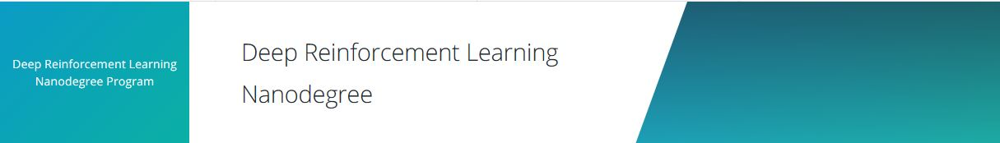

# Udacity Deep Reinforcement Learning Nanodegree 

  
Image: Udacity Deep Reinforcement Learning Nanodegree  

In this repository I will share the **source code** of all the projects of **[Udacity Deep Reinforcement Learning Nanodegree](https://eu.udacity.com/course/deep-reinforcement-learning-nanodegree--nd893)**.  

# Projects  

--- 
## Table of Contents

----  

### Part 2: Value Based Methods

----  

| [Getting Started for Part 2](./Part2_How_to_get_started)       |  **Project 1: Navigation** [Code](./Part2_Project_Navigation)       |        |
| :---:         |     :---:      |          :---: |

---  

## Contributing

No further updates nor contributions are requested.  This project is static.

## License

**UDACITY-Deep Reinforcement Learning Nanodegree** results are released under the [MIT License](./LICENSE).